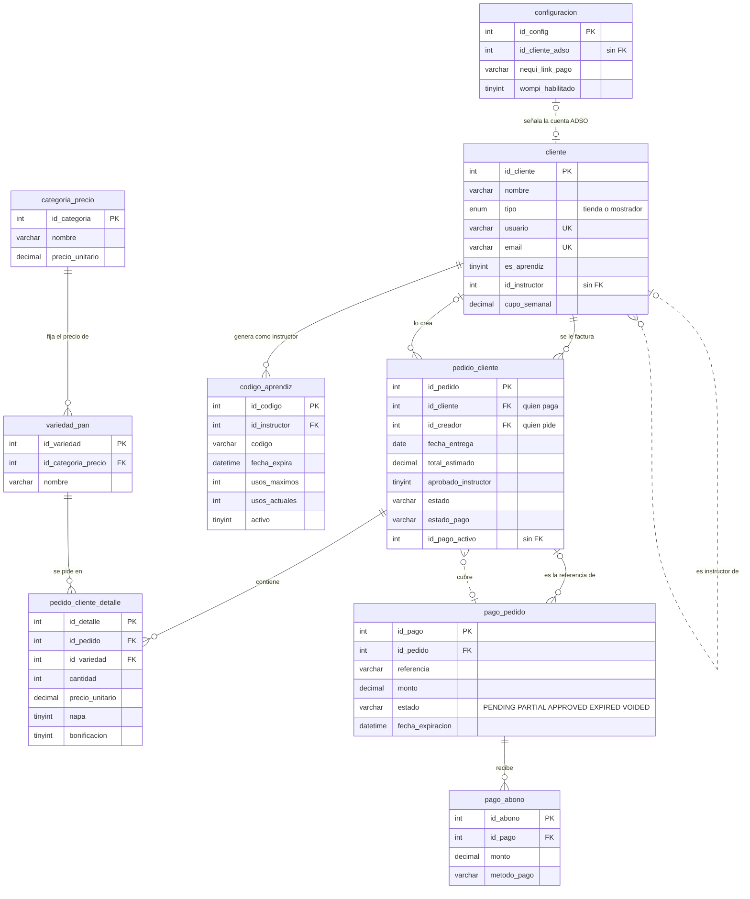
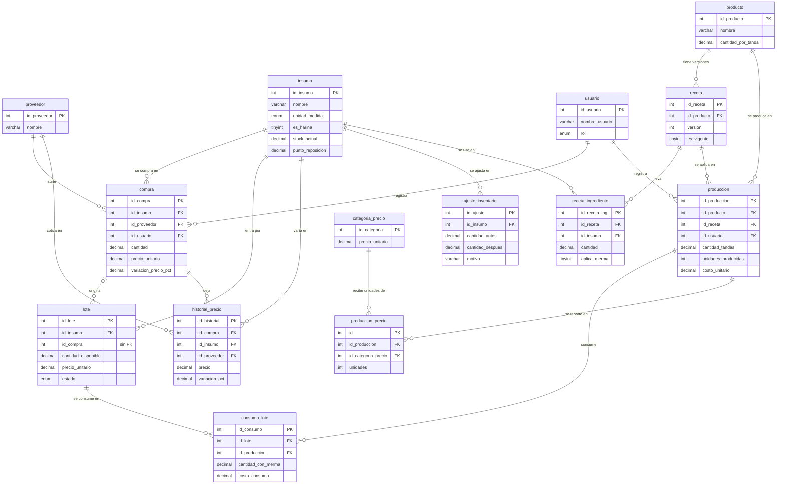
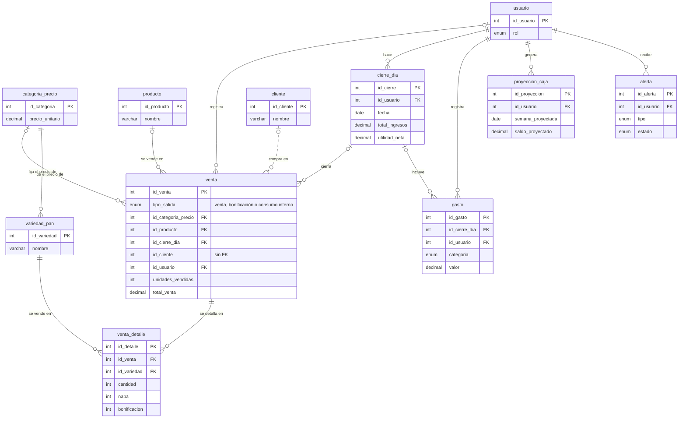
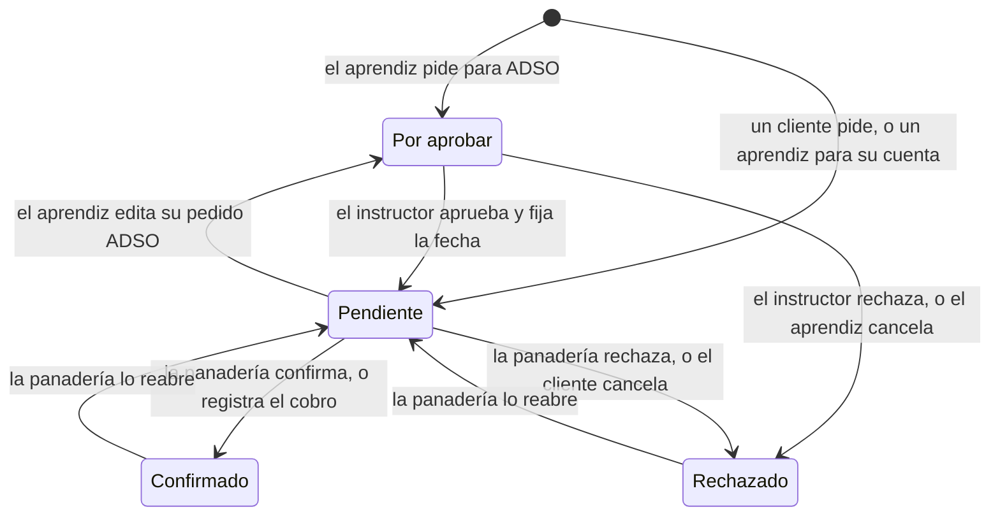
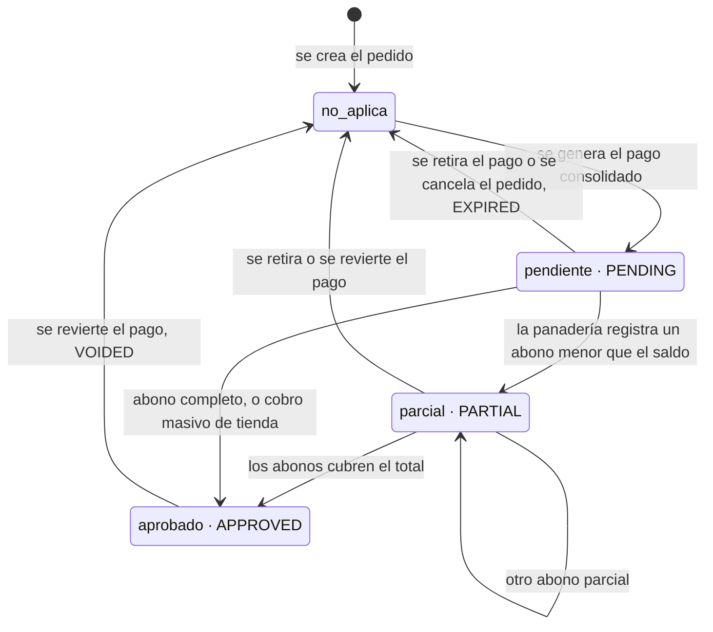
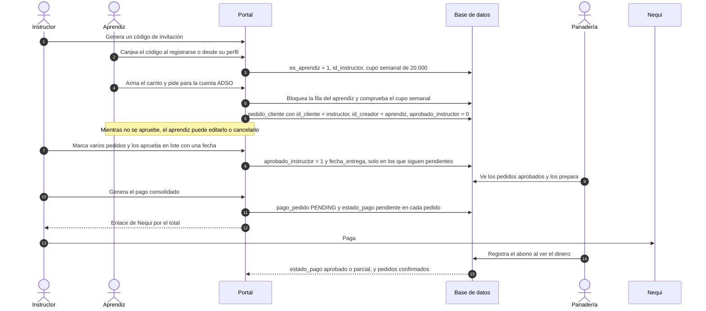
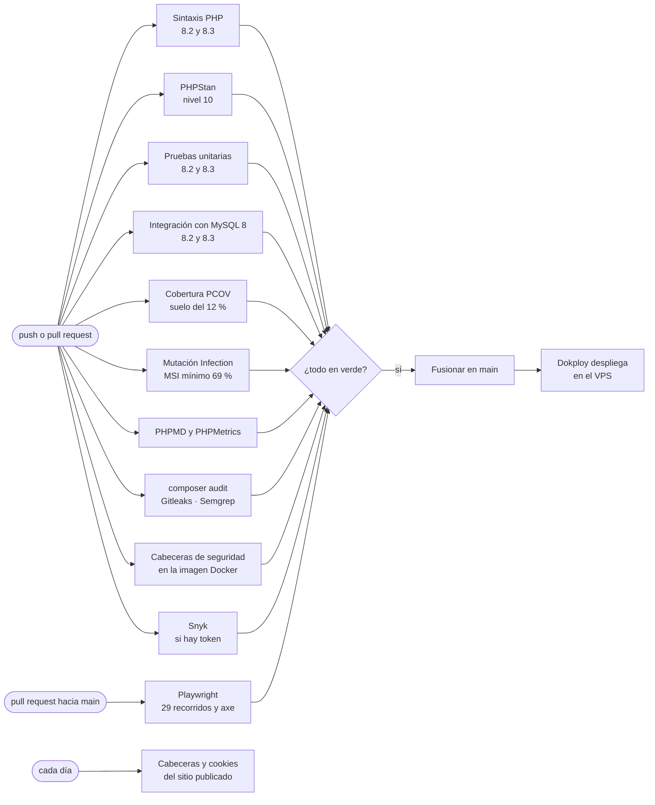

# Diagramas — BreadControl

Estos diagramas se dibujaron el **2026-09-14** a partir del esquema real
(`sql/init/01_esquema_base.sql`, consultado sobre una base recién creada con
`information_schema`) y del código de los modelos. GitHub los dibuja directamente.

**Si cambias el esquema o el flujo de pedidos, actualiza el diagrama en el mismo
PR.** Un diagrama desactualizado es peor que no tenerlo: se cree.

## Contenido

1. [Modelo entidad-relación](#1-modelo-entidad-relación)
2. [Ciclo de vida de un pedido](#2-ciclo-de-vida-de-un-pedido)
3. [Ciclo de vida del pago](#3-ciclo-de-vida-del-pago)
4. [Secuencia: aprendiz → instructor → panadería](#4-secuencia-aprendiz--instructor--panadería)
5. [Procesamiento por lotes en los pedidos](#5-procesamiento-por-lotes-en-los-pedidos)
6. [Integración continua](#6-integración-continua)

La arquitectura por capas está en el [README](../README.md#-arquitectura).

---

## 1. Modelo entidad-relación

La base tiene **29 tablas y 6 vistas**. Para que se pueda leer, el modelo se
divide en tres dominios; `categoria_precio`, `variedad_pan` y `usuario` aparecen
en más de uno porque los unen.

**Cómo se lee:**

- Línea **continua**: clave foránea real, la base la garantiza.
- Línea **punteada**: relación que el código usa pero que la base **no** garantiza
  (no hay clave foránea). Ver [la tabla del final](#relaciones-sin-clave-foránea).
- `||` exactamente uno · `|o` cero o uno · `o{` cero o muchos.

### 1.1 Portal: clientes, pedidos y pagos

**Lo que más confunde de este dominio:** un pedido tiene **dos** clientes.
`id_cliente` es quien **paga** y `id_creador` quien **pide**. En un pedido normal
son la misma cuenta; en el de un aprendiz para ADSO, `id_cliente` es el instructor.
De ahí salen las dos reglas de autorización del portal: solo paga `id_cliente`, y
solo edita `id_creador` (`ReglasPortal::esAutorDelPedido`).

Un pago consolidado cubre varios pedidos: cada pedido lo apunta con
`id_pago_activo`, y el pago guarda en `id_pedido` solo el más antiguo, como
referencia.

### 1.2 Inventario y producción

Casi todas las tablas operativas guardan `id_usuario` (quién registró). Para que el
diagrama se lea, esa relación solo se dibuja en `compra` y `produccion`.

**FIFO:** una producción descuenta los insumos de los lotes más antiguos primero, y
cada descuento queda en `consumo_lote` con su costo. Así el costo de una producción
es el de los lotes que de verdad consumió, no un precio promedio.

> **«Lote» significa dos cosas en este proyecto.** Aquí es un **lote de insumo**
> (una entrada de harina con su precio, que se consume en orden FIFO). En los
> pedidos, «en lote» significa **procesar varios pedidos a la vez**
> ([sección 5](#5-procesamiento-por-lotes-en-los-pedidos)).

### 1.3 Ventas, caja y administración

### Tablas sin relaciones y vistas

| Objeto | Para qué |
|---|---|
| `intento_login` | Intentos fallidos de acceso y de recuperación (`ambito`, `identificador`, `ip`, `fecha`). No referencia cuentas a propósito: también registra intentos contra usuarios que no existen |
| `migracion` | Qué migraciones tiene aplicadas esta base. La crea `sql/migraciones/2026-08-20_01_control_migraciones.sql`, no el esquema base |
| `v_inventario_actual`, `v_insumos_alerta`, `v_lotes_fifo` | Stock, alertas y lotes disponibles en orden FIFO |
| `v_margen_productos`, `v_resumen_financiero_30d`, `v_stock_productos_hoy` | Margen por producto, finanzas de 30 días y stock del día |

### Relaciones sin clave foránea

Estas cinco relaciones las usa el código, pero la base no impide que apunten a una
fila inexistente. Se dejan anotadas porque son las primeras candidatas si algún día
se endurece la integridad del esquema.

| Columna | Apunta a | Qué pasa si queda huérfana |
|---|---|---|
| `cliente.id_instructor` | `cliente` | El aprendiz queda sin grupo. `quitarAprendiz` la pone a `NULL` explícitamente |
| `configuracion.id_cliente_adso` | `cliente` | `getClienteAdso()` lo detecta y el portal muestra un error claro en lugar de enviar pedidos a una cuenta que no existe |
| `pedido_cliente.id_pago_activo` | `pago_pedido` | El pedido parece tener un pago en curso que no existe |
| `lote.id_compra` | `compra` | Se pierde la trazabilidad de qué compra originó el lote |
| `venta.id_cliente` | `cliente` | La venta queda sin cliente asociado |

---

## 2. Ciclo de vida de un pedido

Un pedido del portal combina dos columnas: `estado` (lo que decide la panadería) y
`aprobado_instructor` (lo que decide el instructor, solo en pedidos de aprendiz).

| Estado del diagrama | `estado` | `aprobado_instructor` | Quién lo ve |
|---|---|---|---|
| Por aprobar | `pendiente` | `0` | El aprendiz y su instructor. La panadería **no** lo ve todavía |
| Pendiente | `pendiente` | `1` | Todos |
| Confirmado | `confirmado` | — | Todos |
| Rechazado | `rechazado` | — | Todos. `mensaje_propietario` dice quién lo retiró |

**Reglas que gobiernan las flechas** (todas en `helpers/ReglasPortal.php`):

- **Editar**: solo quien creó el pedido, si sigue pendiente y faltan más de 48 horas
  para la entrega. Si es un pedido ADSO, editarlo **vuelve a exigir** la aprobación
  del instructor y borra la fecha que había puesto.
- **Cancelar**: si sigue pendiente, salvo en las 48 horas previas a la entrega. Un
  pedido ya vencido vuelve a poder cancelarse (punto 30 del anexo de limitaciones).
- **Con un pago en curso**, el aprendiz no puede ni editar ni cancelar.
- **Aprobar o rechazar en lote** solo afecta a pedidos que siguen pendientes: un
  pedido que el aprendiz canceló mientras el instructor tenía el tablero abierto
  no se reactiva (punto 33).
- Un pedido ADSO se guarda con `fecha_entrega = 1000-01-01`, que la interfaz muestra
  como «Por definir» hasta que el instructor lo aprueba.

---

## 3. Ciclo de vida del pago

Hay **dos** columnas de estado con vocabularios distintos, y conviene no mezclarlas:
`pedido_cliente.estado_pago` (minúsculas) y `pago_pedido.estado` (mayúsculas,
definido en `includes/estados_pago.php`).

- **Nadie marca un pago como pagado desde el portal.** El cliente o el instructor
  solo **generan** el pago y reciben el enlace de Nequi. La panadería confirma cuando
  ve el dinero, registrando el abono en el back-office (`PedidoClienteModel::registrarAbonoPago`).
- Registrar un abono también **confirma** los pedidos que cubre (`estado = confirmado`).
- Un abono no puede superar el saldo pendiente, con un peso de tolerancia por redondeo.
- Generar un pago dos veces sobre los mismos pedidos no crea otro: se reutiliza el
  que sigue `PENDING`.

---

## 4. Secuencia: aprendiz → instructor → panadería

El recorrido completo, desde que el instructor invita a un aprendiz hasta que la
panadería confirma el dinero. Los pasos 5 a 12 son los que recorre
`e2e/tests/portal-aprendiz-instructor.spec.js`.

---

## 5. Procesamiento por lotes en los pedidos

El flujo de pedidos está pensado para que nadie tenga que procesarlos uno por uno.
Estos son los puntos donde se opera sobre **varios pedidos a la vez**:

| Quién | Operación | Qué hace con el lote | Dónde |
|---|---|---|---|
| Instructor | **Aprobar en lote** | Aprueba los pedidos marcados y les fija la **misma** fecha de entrega (la hora se pide pero hoy se descarta: punto 34 del anexo) | `InstructorPortalTrait::aprobarPedidosInstructorLote` |
| Instructor | **Rechazar en lote** | Rechaza los pedidos marcados | `InstructorPortalTrait::rechazarPedidosInstructorLote` |
| Instructor | **Pago consolidado** | Junta todos los pedidos aprobados y sin pagar en **un solo pago** y un solo enlace de Nequi | `PortalPagoController::pagarConsolidado` |
| Panadería | **Registrar un abono** | Un abono se aplica al pago consolidado entero y confirma todos sus pedidos | `PedidoClienteModel::registrarAbonoPago` |
| Panadería | **Cambiar estado en lote** | Confirma, rechaza o reabre los pedidos marcados | `PedidoClienteModel::cambiarEstadoLote` |
| Panadería | **Confirmar cobro masivo** | Marca como pagados los pedidos de tienda seleccionados | `PedidoClienteModel::confirmarCobroTienda` |
| Tienda | **Reporte por fecha de entrega** | Agrupa por aprendiz y producto todos los pedidos de un mismo día | `PedidosPortalTrait::getReporteAgrupadoTienda` |
| Cliente / instructor | **Exportar seleccionados** | Genera un solo documento con los pedidos marcados | `PortalExportController` |

Las operaciones del instructor se validan **pedido por pedido** dentro del lote: si
uno no es de su grupo o ya no está pendiente, se excluye, y el mensaje cuenta solo
los que de verdad cambiaron. Las de la panadería no filtran así porque solo las
ejecuta el propietario, que puede actuar sobre cualquier pedido.

---

## 6. Integración continua

Once verificaciones en cada push y pull request, más la comprobación diaria del
sitio publicado. El detalle de lo que exige cada una está en el
[README](../README.md#-integración-continua) y el razonamiento de sus umbrales en
[`estrategia_pruebas.md`](estrategia_pruebas.md).

